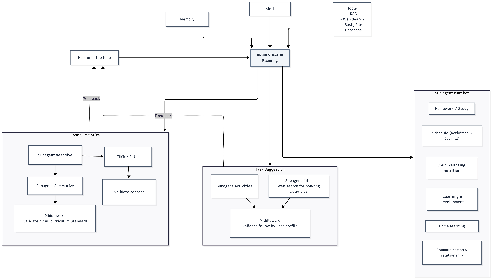

<div align="center">

# 🏫 Srenniw — Bridging Classroom and Home

### *AI-Powered Communication Platform for Teachers & Parents*

[](https://nextjs.org/)
[](https://fastapi.tiangolo.com/)
[](https://www.typescriptlang.org/)
[](https://www.python.org/)
[](https://supabase.com/)
[](https://anthropic.com/)

**[EduX Hackathon 2026](https://cambridge-edtech-society.org/edux/edux-challenge-5.html) — Open EdTech Innovation Track**

[The Problem](#-the-problem) • [Solution](#-our-solution) • [Features](#-features) • [Architecture](#-agentic-system) • [Tech Stack](#-tech-stack) • [Setup](#-setting-up-the-repository-locally)

</div>

---

## 🎯 The Problem

There is a persistent, underserved communication gap between what happens in the classroom and what parents can meaningfully support at home. Teachers invest significant time writing detailed curriculum content — yet parents often receive it in jargon-heavy language with no clear guidance on how to help their children at home.

For families from non-English speaking backgrounds, this gap is even wider. **Research consistently shows that parental involvement is one of the strongest predictors of student outcomes** — yet the tools to enable it simply haven't existed. Until now.

## 💡 Our Solution

**Srenniw** is an AI-powered platform that acts as an intelligent bridge between teachers and parents. A teacher writes once — the AI does the rest:

- Translates complex curriculum language into clear, parent-friendly summaries
- Generates **actionable at-home activity suggestions** tailored to each child's profile
- Delivers personalised notifications to parents **in their native language** (Vietnamese, Mandarin, Arabic, English)
- Enables **real-time two-way communication** between teachers and families
- Provides parents with a **24/7 AI chatbot** to answer curriculum questions

> **One teacher input → AI handles translation, summarisation, personalisation, and delivery across every family.**

---

## ✨ Features

| Feature | Description |
|---|---|
| 📝 **Smart Compose** | Teacher writes assignment or comment once; AI processes and distributes to all parents |
| 🌏 **Multilingual Support** | Auto-translation to Vietnamese, Mandarin, Arabic & English (EAL/D families) |
| 🔔 **Live Parent Inbox** | Real-time Supabase-powered notification inbox — updates without page refresh |
| 🤖 **AI Chatbot** | Streaming AI chatbot for parents to ask curriculum questions anytime |
| 💬 **Real-time Chat** | Direct WebSocket-based messaging channel between teachers and parents |
| 🎯 **Activity Suggestions** | AI-generated at-home bonding & learning activities matched to each child's profile |
| 🧑‍🎓 **Role-Based Dashboards** | Separate, secure portals for teachers and parents via Clerk Auth |
| 📊 **Curriculum Validation** | Agent validates all content against the Australian Curriculum Standards |

---

## 🤖 Agentic System

Srenniw is built around a **custom multi-agent orchestration pipeline** — hand-crafted in Python with no LangChain, no black-box frameworks. Every agent is purpose-built, readable, and auditable.



### Orchestrator (Planning)

The **Orchestrator** sits at the centre of the system, equipped with:
- **Memory** — retains context across sessions for personalised, consistent responses
- **Skills** — specialised capability modules loaded per task type
- **Tools** — RAG retrieval, Web Search, Bash/File I/O, Database access
- **Human-in-the-Loop** — teacher feedback loop for review and refinement before delivery

When a teacher submits content, the Orchestrator delegates in parallel to two specialised task pipelines. A **feedback channel** allows the human-in-the-loop to steer the pipeline output before it reaches parents.

---

### 📋 Task Summarise Pipeline

```
Subagent Deepdive ──→ Subagent Summarise ──→ ┐
                                              ├──→ Middleware: Validate by AU Curriculum Standard
TikTok Fetch ──→ Validate Content ────────────┘
```

Produces a curriculum-aligned, jargon-free summary of the teacher's content. A sub-agent deep-dives into the learning objectives, another handles media content validation (including TikTok/social media fetching), and a middleware layer cross-checks everything against the **Australian Curriculum Standard** before delivery.

---

### 💡 Task Suggestion Pipeline

```
Subagent Activities  +  Subagent Web Search (Bonding Activities)
                              │
                              ▼
              Middleware: Validate against User Profile
```

Generates personalised at-home activity suggestions matched to the child's age, interests, and learning stage. A web-search sub-agent enriches suggestions with current, real-world bonding activities before a profile-aware middleware validates relevance and appropriateness per child profile.

---

### 🗣️ Sub-Agent Chatbot

A dedicated chatbot layer handles parent queries across **six specialised domains**:

| Domain | What it covers |
|---|---|
| 📚 **Homework / Study** | Explaining assignments, learning goals, and how to help |
| 🗓️ **Schedule (Activities & Journal)** | Weekly routines, planning, and journalling |
| 🥗 **Child Wellbeing & Nutrition** | Health, sleep, and diet guidance connected to school performance |
| 🌱 **Learning & Development** | Milestones, skills, and developmental growth |
| 🏠 **Home Learning** | Practical at-home practice ideas aligned to curriculum |
| 🤝 **Communication & Relationship** | How to talk with your child about school life |

---

## 🛠 Tech Stack

```
┌─────────────────────────────────────────────────────────────┐
│                         Frontend                            │
│   Next.js 14 (App Router) · TypeScript · Tailwind CSS      │
│   shadcn/ui · Clerk Auth · Supabase Realtime client        │
├─────────────────────────────────────────────────────────────┤
│                         Backend                             │
│   Python 3.11 · FastAPI · uvicorn                          │
│   Clerk JWT verification · Supabase service role           │
├─────────────────────────────────────────────────────────────┤
│                      AI / Agent Layer                       │
│   CurricuLLM API (OpenAI-compatible)                       │
│   Custom multi-agent orchestration pipeline                │
│   RAG · Web Search · Tool use (no frameworks)              │
├─────────────────────────────────────────────────────────────┤
│                      Infrastructure                         │
│   Supabase (PostgreSQL + Realtime + RLS)                   │
│   WebSocket (FastAPI) for chat + token streaming           │
│   Clerk for role-based auth (teacher | parent)             │
└─────────────────────────────────────────────────────────────┘
```

---

## 🗂 Project Structure

```
srenniw_edx/
├── src/                               ← Next.js 14 frontend (App Router)
│   └── app/
│       ├── teacher/
│       │   ├── dashboard/             ← Teacher overview & analytics
│       │   ├── compose/               ← Write assignments & comments
│       │   └── chat/                  ← Real-time parent chat list
│       └── parent/
│           ├── inbox/                 ← Live notification inbox
│           ├── chatbot/               ← AI curriculum chatbot (streaming)
│           └── chat/                  ← Direct teacher messaging
├── backend/
│   ├── main.py
│   ├── routers/
│   │   ├── teacher.py                 ← Teacher REST endpoints
│   │   ├── parent.py                  ← Parent REST endpoints
│   │   ├── chat.py                    ← WebSocket: Teacher↔Parent
│   │   └── chatbot.py                 ← WebSocket: AI chatbot streaming
│   ├── agent/
│   │   ├── pipeline.py                ← Multi-agent orchestrator
│   │   └── tools.py                   ← CurricuLLM tool definitions
│   └── db/
│       └── supabase.py                ← Supabase client singleton
└── docs/
    └── agent_architecture.png         ← System architecture diagram
```

---

## 🔑 Key Design Decisions

**Agent as middleware** — Teacher submits content → saved as `status=pending` → agent pipeline runs async → result saved to `briefs` table → Supabase Realtime fires notifications to all parents in the class. The frontend updates live without any refresh.

**Two separate WebSocket channels** — `/ws/chat/{room_id}` for direct teacher↔parent messaging; `/ws/chatbot/{parent_id}` for AI chatbot with token-level streaming so responses feel instant.

**No agent frameworks** — The orchestration pipeline is hand-crafted using `async`/`await` Python. No LangChain, no LangGraph. Every step is readable, testable, and easy to swap in the real CurricuLLM API.

**Role isolation at every layer** — Clerk assigns `teacher` or `parent` roles at login. The frontend redirects accordingly, and every FastAPI route verifies the role from the JWT before processing any request.

**Ethical AI design** — All AI-generated content is validated against the Australian Curriculum Standard before delivery. Parents see clearly AI-generated content and can always escalate to a real teacher. No child data is used for model training.

---

## 🚀 Setting up the Repository Locally

To start working on the project on your local machine, first clone the repository:

```bash
# Clone the repository
git clone https://github.com/nndang27/srenniw_edx.git

# Navigate into the project directory
cd srenniw_edx
```

### Installation & Running the Servers

**Frontend (Next.js):**
```bash
cd src
pnpm install
pnpm dev
```

**Backend (FastAPI):**
```bash
cd backend
python -m venv venv
source venv/bin/activate  # On Windows use: venv\Scripts\activate
pip install -r requirements.txt
uvicorn main:app --reload --port 8000
```

### Environment Variables

**`src/.env.local`**
```env
NEXT_PUBLIC_CLERK_PUBLISHABLE_KEY=pk_test_...
CLERK_SECRET_KEY=sk_test_...
NEXT_PUBLIC_SUPABASE_URL=https://xxx.supabase.co
NEXT_PUBLIC_SUPABASE_ANON_KEY=sb_publishable_xxx
NEXT_PUBLIC_BACKEND_URL=http://localhost:8000
NEXT_PUBLIC_WS_URL=ws://localhost:8000
```

**`backend/.env`**
```env
CLERK_PEM_PUBLIC_KEY="-----BEGIN PUBLIC KEY-----\n...\n-----END PUBLIC KEY-----"
SUPABASE_URL=https://xxx.supabase.co
SUPABASE_SERVICE_KEY=your_service_role_key
CURRICULLM_API_KEY=your_curricullm_key
CURRICULLM_BASE_URL=https://api.curricullm.com
```

---

## 👥 Team

Built with ❤️ at **[EduX Hackathon 2026](https://cambridge-edtech-society.org/edux/edux-challenge-5.html)** — Open EdTech Innovation Track, Cambridge EdTech Society

---

<div align="center">

*Bridging the gap between classroom and home, one AI message at a time.*

</div>
